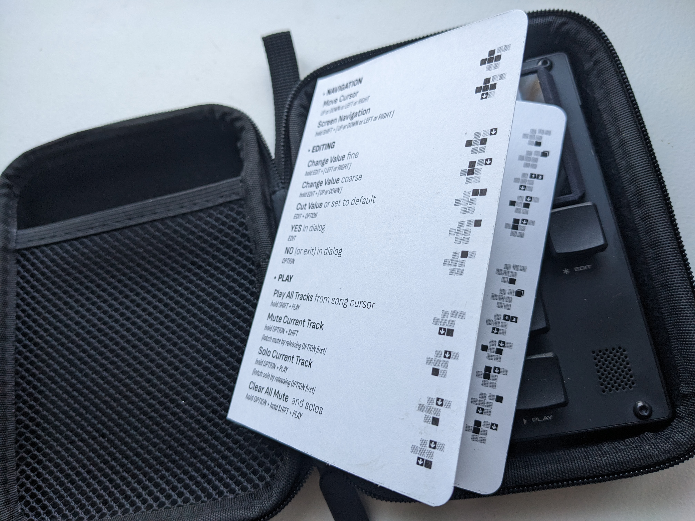

# M8 Shortcuts Guide

A foldable 4-page mini guide containing shortcuts for the Dirtywave M8.

Printable on a letter paper sheet and can be stored in your M8 case once folded.

## Instructions

Print the PDF file, fold on the dotted lines, cut using the corner cut marks.

You can glue the first fold for a cleaner look.

Do not follow the paper edges when folding, your printer might not be super accurate, like mine.

## To customize or update 

All shortcuts are entered in a JS array which is then rendered.

### Button pad syntax

There is no need to edit button pad icons, a single svg template is customized via css.

#### Example

To illustrate the shortcut "hold SHIFT + OPTION then double-tap EDIT", enter :

    shifthold option1st edit2nd double
    
### Create PDF

In your browser, Print to PDF using custom margins (0.25" all around).
